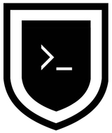

# Unix Commando

Operations of unix command line forces.

## Operations

- [Wolf](./operations/wolf)

  Clean folder from files older than 10 days.

- [Summoner](./operations/summoner)

  Sum everything from the column.

- [Little Switch](./operations/little-switch)

  Change file extensions from .JPG to .jpg

- [Quote Game](./operations/quote-game)

  Find file containing specific line.

- [Summer Trip](./operations/summer-trip)

  Navigate to the folder of the file you are looking for.

- [No Time To Sha-Bang](./operations/no-time-to-sha-bang)

  Create shell function without any intermediate shell script files.
  
- [Pipe to Copy](./operations/pipe-to-copy)

  Pipe the command line result into the clipboard.

- Next to come...
